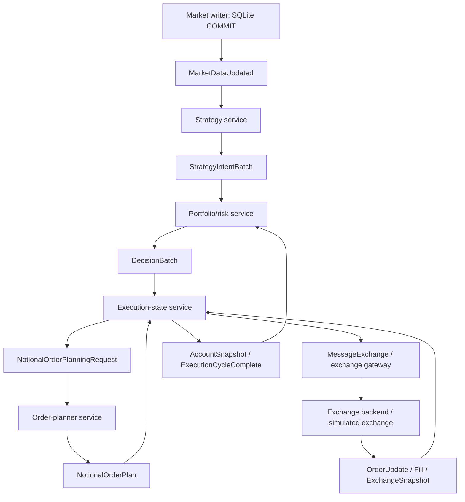

# Current architecture and source navigation

This is the current architecture map, checked against source on 2026-10-08.
[The documentation index](../README.md) lists the maintained guides;
[CURRENT_STATE.md](../../CURRENT_STATE.md) records validation evidence and limitations.
[The roadmap](../ROADMAP.md) owns ordered pending requirements and venue-selection priorities.
Source and current build/test output take precedence over these descriptions.

PortfolioRiskEngine optionally captures sized weights, asset/gross cap evaluations,
volatility diagnostics and actual rebalance actions without changing DecisionBatch.
PortfolioRisk service persists that observation as nullable `risk_diagnostics_payload`
in the same decision-checkpoint INSERT, carrying the cycle timestamp/configuration
identity. The dashboard validates that lineage and displays its identity SHA-256;
it does not recompute strategy economics. HOLD preserves quantity rather than
emitting the evaluated target. Old rows and canonical replay snapshots retain
unavailable intermediates. Whole-account/venue margin and control readiness remain
separate pending work.

PAPER liquidity uses a separate `pure_rsi_quote_volume.json` profile and actual
Binance completed-kline quote turnover. `OHLCV.quote_volume` is optional for older
base-only data; the live SQLite writer migrates/backfills it, the canonical reader
loads it without estimating, and `PriceField::QuoteVolume` exposes it to indicators.
Source `volume` keeps its existing replay/capacity meaning. Dashboard PAPER uses the
same metric, preserves old cycle provenance through `QUOTE_VOLUME_FROM`, and starts
its rolling comparison after that boundary. See the PAPER guide for state migration.

## Repository map

| Directory | What belongs here |
| --- | --- |
| `lib/` | Current reusable trading domain and venue simulation. |
| `live_trading/` | Service entrypoints, adapters and service-owned lifecycle. |
| `research/` | Public replay CLI, canonical runner and research executables. |
| `dashboard/` | React UI, Go read-model API, observability stores and deployment. |
| `validation/` | Current release gate, component tests and focused source audits. |
| `deploy/` | LIVE, current-data paper and isolated historical Compose deployments and packaging. |
| `config/` | Runtime configuration, source-symbol maps and venue registries. |
| `docs/` | Documentation index, agent handoff and frozen venue specifications. |
| `storage/` | Historical inputs, reports and accepted run evidence. |
| `tools/` | Analysis utilities and historical diagnostic runners. |
| `.ai/` | Ignored generated file/component navigation, refreshed from the current working tree. |

Generated replay state and outputs live under `deploy/historical_replay/run/`.
They are evidence or runtime data, not additional implementation directories.

`python3 tools/generate_ai_index.py` creates `.ai/README.md`, `components.md`
and `index.json`; `--check` detects stale output. The generated index links to
maintained guides and source instead of owning architecture/readiness prose.
The [index guide](AI_INDEX.md) defines inputs, exclusions and navigation limits.

## Library responsibilities

Start at an orchestration file and follow its collaborators. The detailed file map is
[lib/README.md](../../lib/README.md).

| Directory | Responsibility and useful starting files |
| --- | --- |
| `data_types/`, `market/` | Bars, canonical visible history, price snapshots; `canonical_market_data_reader.*` and `rolling_market_state.*`. |
| `indicator/`, `universe/`, `ranker/`, `filter/` | Features, liquidity selection, ranking and filters. `AlphabeticalRanker` means deterministic ordering without indicator scoring. |
| `strategy/`, `signal/` | Strategy interfaces, instances and signal state; `strategy_signal_engine.*` orchestrates intent generation. |
| `strategy/validated/` | Accepted concrete strategies; currently only `pure_rsi.h`. |
| `risk/`, `sizing/`, `portfolio/`, `rebalance/` | Allocation, constraints, approved targets and rebalance policy; `portfolio_risk_engine.*` and `portfolio_targets.h`. |
| `execution/` | Stateful execution engine, orders, fills and order manager. |
| `execution/planning/` | Monetary/quantity planners, immutable planning state, target resolution and order construction. |
| `exchange/` | Venue interfaces; implementations are grouped below. |
| `exchange/mock/` | Admission, matching, accounting, recovery, reconciliation, fault simulation and catalog/rules. Start at `exchange.h`. |
| `exchange/adapters/` | `MessageExchange`, `BackendGateway` and `SimulatedExchange`. |
| `runtime/` | `decision_engine.*`, `trading_engine.*`, `replay_runtime.*` and `manual_trading.h`: workflows rather than component ownership. |
| `contracts/` | Market/execution messages, decision/account snapshots and canonical venue contracts. Related small messages share headers. |
| `transport/` | `MessageBus`, `JetStreamBus`, `MessageJson` and `MessageSubjects`. Wire subject versions remain part of the protocol. |
| `persistence/`, `recovery/` | SQLite/PostgreSQL state stores, recovery coordination and reconciliation. |
| `account/`, `position/` | Account and current/target/virtual strategy positions. |
| `backtest/`, `analytics/` | Lightweight historical loop and reporting: `backtester.*`, `backtest_results.cpp`, `BacktestAccountSnapshot`. |
| `logging/`, `utils/`, `testing/` | Logging, shared technical helpers, `TimeHandler` and test doubles. |

Small modules stay flat. Planning, venue implementations and validated strategies have
subfolders because they are distinct responsibilities. There are no forwarding headers
for removed names. Ignored `strategy/on_hold/` experiments are outside the supported
build and may still use the old research API.

## Canonical replay

Public entrypoint: [research/replay.py](../../research/replay.py).
The CLI selects a window/profile, builds the runner, invokes it and compares exports
directly with RealTest. Full usage: [research/REPLAY.md](../../research/REPLAY.md).

```mermaid
flowchart LR
    INPUT["Original historical OHLCV"] --> CLOSE["Completed close(T)"]
    CLOSE --> SIGNAL["Strategy intent"]
    SIGNAL --> RISK["Risk / monetary targets"]
    RISK --> PLAN["Notional plan"]
    PLAN --> OPEN["Execution at open(T+1)"]
    OPEN --> VENUE["Canonical MOCK admission / fills"]
    VENUE --> ACCOUNT["Positions / accounting / reconciliation"]
    ACCOUNT --> OUTPUT["Fingerprint / exports / comparison"]
```



- `fast` invokes `research/src/legacy/backtesting_main.cpp`, whose current
  build uses CURRENT `lib/backtest/Backtester`. The directory name does not imply
  that this particular executable uses the frozen runtime.
- `system` invokes `research/src/canonical/canonical_replay.cpp` and
  `lib/src/runtime/replay_runtime.*`: modern strategy, risk, planning and MOCK.
- `dashboard` uses the same system economics and publishes replay state for
  the simulation provider. UI observation and pacing do not change fills.

### Timing and economics

Strategy/risk read completed `close(T)`. In `realtest-parity`, risk fixes
monetary targets at that close and quantity is resolved using `open(T+1)`.
Exits flatten the actual held parity quantity. The exact double-precision economic
mirror preserves research sizing and exports, while the canonical venue still exercises
its rule-conforming lifecycle and reconciliation. It is not a new independent strategy.

Parity has zero fees/slippage, full next-open fills and no historical-volume capacity
limit. Original OHLCV is never rewritten. `mock-default` retains venue grids,
fees, volume participation, slippage and partial fills. Do not carry parity shortcuts
into ordinary venue execution.

`--start` starts cold; `--pace-start`/`--pace-end` observe a later
interval after earlier history has warmed the state. `--days` selects available
historical days, including the cutoff. The comparator treats campaigns still open at
that cutoff separately from closed trades; no mismatch identity is whitelisted.

### Restart/resume

System/dashboard checkpoints are safe only after a completed close. The MOCK durable
checkpoint and replay boundary agree. Resume removes journal entries after that boundary,
recovers venue state and deterministically rebuilds strategy/risk/planner state through
the same close before continuing. The CLI requires the same label/window.
The release gate compares resumed, uninterrupted, dashboard and paced fingerprints.

## Service trading

`live_trading/kraken_shadow.py` owns Kraken public Multi-M normalization and a
hypothetical BTC/USD cross-margin diagnostic. It reuses `ShadowJournal` with an
explicit assessor and durable venue/environment identity; fixture and real-public
journals cannot be mixed. Fixed GET-only hosts/routes, server freshness and raw
capture hashes bound the observations. A source USD plan is observed against the
current mark without changing close(T), contract units or trading state. Missing
books/metadata are unavailable, not unsupported-market skips. Hypothetical collateral
uses the BTC index and haircut and distinguishes USD reserve from margin value.
Private account margin, settlement and live derivatives accounting remain separate;
`lib/Account` is still a cash/filled-position account. Legacy-demo redirects are
rejected without live fallback. See the [Kraken preparation guide](../../live_trading/README.md#kraken-multi-m-preparation).

`live_trading/kraken_account.py` owns separate read-only private account inspection:
fixed authenticated GETs with permission gating, fresh UTC clocks, Multi-M wallet
normalization, signed positions/open orders and an account/source/policy-bound SQLite
journal. Margin equity and order-inclusive requirements come from the venue, rather
than the public hypothetical haircut calculation. USD reserve/loss stress checks
do not approve trading. The dedicated loader consumes the ignored .env internally;
diagnostics never expose its values. Mutually exclusive CLI account/fixture modes
use separate journals. Safe attempt status distinguishes HTTP access failures from
completed reads. Real read-only Multi-M BTC/USD inspection passed; no forward venue,
private order/capital acceptance, submissions or core Account writes are claimed.
The user-selected policy observes USD 50 minimum net venue marginEquity and 10%
available USD. Equity/current-cash checks and projected-loss stress have separate
diagnostics. No leveraged-notional denominator, rebalance, order admission or closing
behavior is added. Changing policy requires a separate account observation journal.

`live_trading/kraken_account_monitor.py` owns continuous local read-only polling and
durable account-warning transitions in the account journal. It publishes the existing
step43-v1 heartbeat/events contract to an isolated Go dashboard-alert-notifier
container, reusing its Telegram sink and durable receipts. It does not implement a
second sender or trading engine. Unchanged warnings are not repeated; only validated
fresh account recovery resolves them. Source failures block notification processing
rather than fabricate recovery. Private account credentials stay in the internal
reader; Docker internally consumes the local Telegram env file. A process lock
prevents concurrent writers. No VPS installation, order admission or closing rule is
implied; local observer uptime and permanent history retention remain operational concerns.

`live_trading/kraken_portfolio_summary.py` owns daily USD valuations and calendar
snapshot/summary persistence in that same account journal transaction. The monitor
uses verified public linear USD marks only for exposure, preserves each UTC day's
latest observed holdings and emits one INFO event per day after the configured UTC
hour. Missing prior-day or price evidence remains explicit. Account labels pass
through the optional account field in alertstore.Alert and notifier.Notification.
The shared Telegram formatter presents severity/account-or-system/reason/detail,
while full technical identities remain in durable journals. Daily events retain
source deduplication but bypass the operational update cooldown after INFO admission.

Account-warning projection additionally compares current net equity with the last
observed snapshot in the preceding UTC day and computes gross absolute marked USD
open-position exposure/net equity. Defaults are a 10% decline and exposure above
5x; both are warning-only. Missing history/prices or nonpositive denominators remain
unavailable and retain prior active warnings. The monitor does not implement an
account kill switch or change the library's strategy sizing/gross constraint.
The user cancelled additional opening-order limit/admission changes; existing sizing
and order behavior remain intact. Daily position text includes absolute marked USD
notional as a percentage of the same snapshot's positive net equity; prior-day
percentages remain tied to the prior observation, and unavailable inputs are explicit.

`live_trading/shadow_observer.py` reads exported CURRENT notional planner payloads
without recomputing signals/sizing or publishing order/fill messages. Its separate
SQLite observation journal binds the persisted risk-configuration fingerprint and
producer message/payload hashes. Completed observations survive duplicate delivery/
restart; unavailable fixture reads remain retryable. This fingerprint is not a full
strategy/market/venue manifest. The preparation reader accepts loopback GET /snapshot
only, disables proxies/redirects and has no private credentials or order methods.
It observes fixture quantity rules/marks without changing the source plan; fees,
funding, collateral, FX, fills and PnL remain unavailable.

`validation/shadow_trading_test.py` reuses the bounded PAPER fixture through an
opt-in handoff after real producer and simulated-fill/restart checks. It tests
unsupported markets, metadata freshness, HTTP cuts, identity conflicts and observer
recovery, then writes labelled fixture HTML/JSON reports in ignored isolated state.
Actual venue reads and aligned backtest/shadow acceptance remain separate.

The service responsibilities and intended execution chain are documented in [live_trading/README.md](../../live_trading/README.md).



`execution_service` is a separate direct execution-engine service path.
The default `deploy/live` deployment stops at `NotionalOrderPlan`;
execution-state does not submit exchange orders there. The diagram includes the full
execution/backend chain supported by other runtime components, not a claim that LIVE
private routing is connected. Gateway is an optional transport-only profile.
`binance_simulator` serves Binance-compatible HTTP; it does not own canonical
market-data SQLite. The historical feeder shares `market_store.*` with the live
writer and gates historical visibility before committing each day.

### Durability

- Market-data SQLite commits before the update notification is published.
- Strategy/risk/planner publish deterministic output before marking their input
  checkpoint handled. Redelivery can reproduce output; deterministic identities and
  downstream deduplication prevent economic duplication.
- Execution persists owned state/outbox before dispatch and applies fills once by ID.
- Plans represent intent, not fills. Account state changes from actual execution events.
- `Ack` means handled durably; `Retry` requests redelivery; `Terminate`
  rejects an invalid input permanently for that consumer.

Follow the actual handler/store ordering when changing a service. Do not assume every
service has the same commit/publish sequence.

`validation/transport_persistence_integration_test.py` exercises current transport
and PostgreSQL adapters against isolated real infrastructure, including SQL rollback
and commit-before-ACK consumer failure followed by broker/database restart. Its
fixture handler uses recovered fill IDs to avoid applying economics twice; audit
row deduplication alone is insufficient. This component proof is separate from
full deployed-service recovery and VPS acceptance.

`validation/local_service_campaign.py` prepares a bounded controlled environment
from the historical Compose topology with an internal network, fresh named state,
generated credentials and current service binaries. It provides pipeline evidence,
duplicate/fault injection, test-database checkpoint/outbox barriers, append-only
daily captures and Docker resource samples. Its simulated exchange is isolated
from LIVE/private routing; [the runbook](../../validation/LOCAL_SERVICE_CAMPAIGN.md)
defines the acceptance limits and cleanup commands.

The opt-in PAPER recovery study in validation/paper_recovery_test.py uses actual
packaged services: trading without dashboard workers, HTTP/NATS/PostgreSQL cuts,
then a maintenance-stop backup of logical PostgreSQL and stopped market/NATS/
observer volumes. Restore targets a fresh isolated project and checks all public
SQL tables/files before restart and retained economics afterward. This boundary
requires quiesced writers and a drained exchange outbox; it is not an online
cross-store snapshot or an unattended reconnect/production backup contract.

`research/replay.py resources` adds bounded resource orchestration, not another
replay engine. `resource_profile.py` owns the isolated service/dashboard lifecycle,
Docker/optional Windows sampling and read-only client; `resource_report.py` writes
the offline CPU/RAM graph. It invokes the existing canonical dashboard path with
private output/state directories. Its background service fixture and canonical
backtest remain distinct workloads. Builds are outside the timed window; failures
keep partial evidence and shutdown is confined to the generated project.

### Business versus technical time

`lib/src/utils/time_handler.*` controls economically visible time.
`time_handler_factory.*` parses environment settings. Daily scheduling and candle
visibility use business time. Polling, backoff and shutdown responsiveness use real
technical time and must not accelerate with replay.

There is no shared logical-clock service, replay controller, ClockState control plane
or `deploy/distributed_replay/`. The isolated historical Compose workflow creates
one `time.env` per run and shares its immutable reference settings among services.
It is a separate integration workflow, not the canonical RealTest release entrypoint.

## Research migration

All six useful research consumers use CURRENT lib APIs. The frozen runtime and
comparison target have been removed after migration. The `src/legacy/` directory
name remains for the entrypoints; it does not imply an old execution engine.

The HTML report source now builds CURRENT PureRSI and research Donchian/XH/XH-ATR reporting as
`algotrading_research_html`, using current `Backtester`, strategy instances,
equal-weight sizing and fill-derived account/analytics. Its CSV/HTML contracts remain;
execution settings, baseline trades and account snapshots provide extra evidence.
The reporting gate checks explicit CSV/HTML contracts and CURRENT accounting
without compiling a second economic implementation.
The source-level consumer inventory and bounded study controls live in
[research/REPLAY.md](../../research/REPLAY.md).

Donchian's signals remain research-only; its exits now follow CURRENT next-open
execution rather than the old same-close fill. XH/XH-ATR use one-bar stop entries:
close fixes trigger/notional; the completed following bar determines crossing,
gap fills preserve monetary amount, and untriggered or missing-asset entries expire.
Actual fills drive current positions/accounting. Exits wait for a later open;
no future-bar lookup or forced same-close cutoff exit occurs. ATR trailing state
reconstructs from actual entry and completed bars, excluding entry-bar high.
The simulator supports this research path; service wire/schema-v1 durable state
and other adapters reject stop entries. No durable/live stop support is claimed.
The XH robustness consumer now uses the same CURRENT strategy, sizing and accounting,
retaining its own full grids and reporting contracts. Initial parameter studies and
statistics now share seven CURRENT research configurations in
`research/src/common/research_strategy_definitions.h`. Timed strategies observe
fill-derived campaigns and count observed asset bars. Market entries may signal
an exit at entry-bar close; ATR/MRShort timed exits exclude that close. MRShort
uses a one-bar short stop and a protective cover sized from actual fills. The
simulator preserves its explicit bullish/bearish entry-bar OHLC assumption;
later stops cover at max(stop, open). Timed market covers cancel their bracket.
Schema/wire guards reject bracket fields as well as entry stops, and stateful
research strategies reject durable-store attachment.
BTC moving-average reporting now reuses the shared PureMom/MRShort definitions,
with its original SMA sweep and CSV/HTML contracts. The scenario consumer now uses
CURRENT APIs for all eight isolated strategy families and 18 dataset definitions.
`research/src/legacy/multi_strategy_main.cpp` owns settings and study orchestration;
`research/src/common/scenario_reports.*` owns embedded charts and correlation reports.
Shared short/momentum signals accept per-scenario benchmark symbols, with BTC defaults.
Benchmarks come from the same bounded market data as trading. Synthetic intraday keys
are retained; annualization uses explicit bar frequencies. All useful consumers have
current paths. Generated `.ai/` navigation is available. Daily host logging has a
locally tested rsyslog receiver, bounded diagnostic writer, minute retention timer
and optional LIVE/dashboard overlays. Daily host logs retain today/yesterday and
trim older entries before a file exceeds 50 MiB;
VPS installation, initial PAPER cycle, boot recovery and receiver restart pass;
multi-day/fault/capacity acceptance and private venue readiness remain pending.

`deploy/paper_trading/` is a separate current-public-data stack with virtual funds
and the durable simulated exchange. Ingestion opt-in fetches only open(T+1), publishes
the execution-price contract before the completed T update, and keeps unfinished
candles out of feature SQLite. Service sizing retains close(T); simulated opening
fills are not live-price or canonical-sizing parity evidence. The paper bundle option
targets its own directory; default LIVE packaging remains separate. A host collector
writes atomic JSON, read by dashboard API with project/schema/freshness checks.
Infrastructure refreshes CPU/RAM/disk and container observations every 10 seconds.
Dashboard market mounts are read-only; observer-created writable SQLite WAL/SHM
must not prevent ingestion. VPS systemd startup waits for the loopback receiver,
with scoped AppArmor permissions, and receiver restart does not stop PAPER.
No dashboard Docker socket; process health does not establish trading readiness.
Current local source probes trading executables through host-owned Docker top and
reads systemd NTP synchronization status; unavailable probes remain UNKNOWN and
clock offset is unmeasured. Daily PAPER decision/plan freshness uses durable business
dates, not database-write recency, with an explicit 30-minute UTC rollover grace.
Empty plans count as progress. External process sampling is not an application
heartbeat or response/control contract. The deployed VPS retains its earlier source
until an authorized update. Local capture reuses the two-day/50-MiB daily writer;
the optional VPS overlay covers all services. See [paper operations](../../deploy/paper_trading/README.md).
The [VPS equivalence procedure](../../deploy/live/README.md#local-to-vps-equivalence-acceptance)
compares source/input identity, configured builds, packaging, non-secret settings
and bounded Step59 results before separate deployed-cycle acceptance.
Kraken is the likely initial live venue, subject to perpetual coverage and BTC
collateral/account eligibility checks against Hyperliquid. Existing Hyperliquid
public/testnet components describe current source, not the selected future venue.
Exact source paths and the research backlog
are in [CONTEXT_FULL.txt](CONTEXT_FULL.txt).

## Dashboard boundary

Pending reporting requirement (not implemented): Trades must expose separate
Commission and Funding columns in USD and net PnL after both; gross trade PnL is
optional. Runtime/venue accounting must own actual fee/funding events and their
attribution, timestamps, signs and currencies; the API/UI reads that evidence and
must not invent missing funding or double-count costs. Keep trade and Perpetuals/
Costs totals consistent with durable account history. The ordered roadmap also
reserves a task for future dashboard adjustments once the user specifies them.

The optional PAPER activity study adds `deploy/paper_trading/comparison.py`, a host
read-only collector with a separate immutable daily market/account observation
journal. It invokes `research/src/common/paper_baseline.cpp` through the existing
fast research binary in a network-disabled container. CURRENT TradingEngine,
PureRSI, sizing and fill accounting own baseline decisions; no Python trading engine
is introduced. The activity overlay keeps original account/message volumes and
selects a distinct 50/40 experiment. The API reads bounded atomic comparison JSON;
Live vs. Expected presents simulated and fast equity/cash/positions with visible
close-versus-open quantity differences. No private Kraken account is merged or traded.

React talks to the Go API over authenticated HTTP and SSE. Browsers do not connect to
PostgreSQL, SQLite, NATS or an exchange. The API's `mock`, `real` and
`simulation` providers are different read-model sources.

Mobile access was cancelled by the user on 2026-10-09 and is not a pending requirement.
The retained optional same-Wi-Fi helper is `deploy/paper_trading/mobile_access.py`
on the PC: a TLS byte-stream bridge with one exact source-IP allowlist targets an
existing loopback dashboard or VPS SSH tunnel. It neither bypasses API auth nor
starts trading/changes the VPS. Generated certificates stay ignored; host firewall
setup is documented in the inactive optional PAPER runbook. The upstream
remains loopback HTTP with its existing cookie settings; the phone listener is TLS-only.

Real reads use bounded PostgreSQL queries, canonical SQLite and retained NATS snapshots.
SSE asks the browser to refresh resources; it does not expose raw trading messages.
The frontend closes EventSource on pagehide and React unmount, reconnecting on
pageshow so cached/old documents do not retain connections that block REST reads.
Watchdog alerts, notification receipts, manual-intent audits and acknowledgements have
their own stores; they are not canonical fills or PnL.

PAPER defaults to TEST_FILE notifications and can opt into Telegram through ignored
environment settings. The fixed-endpoint Telegram adapter persists delivery receipts
and defers all sends during its in-memory retry_after window; failed events remain
unprocessed. --test-message explicitly sends one setup message without replaying
watchdog lifecycle. Fresh host pressure, observed process loss/clock unsynchronization
and degraded daily progress now feed the existing operational alert projection.
The notifier requires a successful watchdog heartbeat within 90 seconds, rejects
timestamps over 30 seconds ahead and waits after a failed source sweep. Stale source
state is not replayed as current alerts. Real local setup and isolated two-message
delivery/recovery passed; actual trading-fault coverage and VPS rollout remain separate.

Manual preview/route enforce operator authentication and CSRF. Route evaluates admission
and durably audits an intent with `submitted=false`; no private exchange order is
sent. Public venue metadata/symbol/rule checks do not establish private execution readiness.
Fill-derived ledger projections are not durable cost-basis/PnL accounting.

See [dashboard/README.md](../../dashboard/README.md) and its five detailed guides in
`dashboard/docs/`. Dashboard loss must not stop trading.

## Validation and retained history

The default WSL gate is `bash validation/step59_canonical_replay_release_gate.sh`.
Its compact expected fingerprint is:

```text
94fdf8d84607dd31c8fa04ecde571738dfabfc234dedff75cd133793dc768da2
```

[validation/README.md](../../validation/README.md) maps component tests, current service
audits and optional runtime checks. Frozen `docs/venue/step*/` specifications and
checksum manifests remain at their original paths because gates consume them. Some
historical source paths/checksums predate renames; they are not current navigation.
Do not regenerate them to hide drift.

The compact gate does not replace a full-history manual comparison, a paced browser
campaign, broker/container recovery tests or private TESTNET/shadow readiness work.
