# algoTrading — Full architecture and navigation graph

This file is intentionally detailed. It is a map for Codex or a developer who is new to the repository.

**Important:** diagrams describe the known current architecture and validated flows. Source code remains the source of truth.

---

# 1. Repository-level map

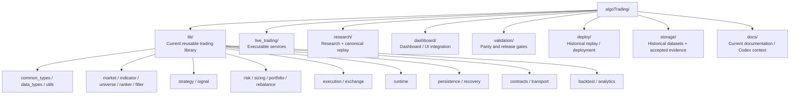

---

# 2. Library domain map

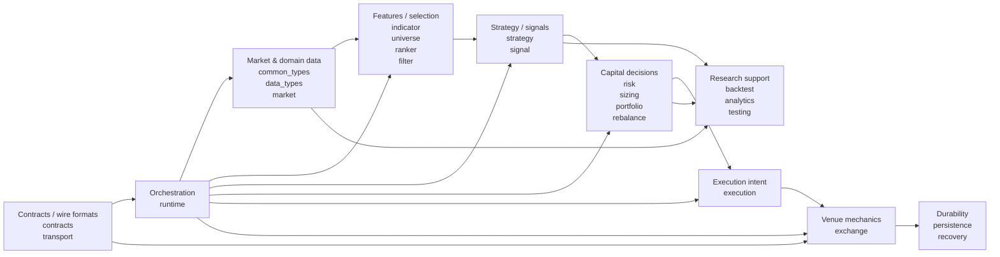

---

# 3. Economic trading flow

```mermaid
flowchart LR
    BAR["Market bar / observation"]
    ROLL["Rolling market state"]
    IND["Indicators / features"]
    UNIV["Universe / ranking"]
    STRAT["Strategy decision"]
    RISK["Risk approval / target"]
    SIZE["Sizing / monetary target"]
    PLAN["Order planning"]
    EXEC["Execution engine"]
    ADAPTER["Exchange adapter"]
    LIFE["Order lifecycle"]
    MATCH["Matching"]
    FILL["Fill"]
    POS["Position state"]
    ACCT["Cash / margin / accounting"]
    PNL["Realized + unrealized PnL"]
    RECON["Recovery / reconciliation"]

    BAR --> ROLL
    ROLL --> IND
    ROLL --> UNIV
    IND --> STRAT
    UNIV --> STRAT
    STRAT --> RISK
    RISK --> SIZE
    SIZE --> PLAN
    PLAN --> EXEC
    EXEC --> ADAPTER
    ADAPTER --> LIFE
    LIFE --> MATCH
    MATCH --> FILL
    FILL --> POS
    FILL --> ACCT
    POS --> PNL
    ACCT --> PNL
    ACCT --> RECON
    LIFE --> RECON
```

---

# 4. Canonical replay entry path

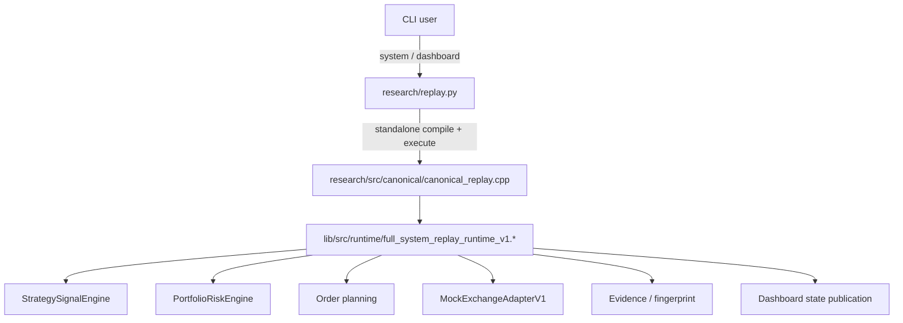

Important build detail:

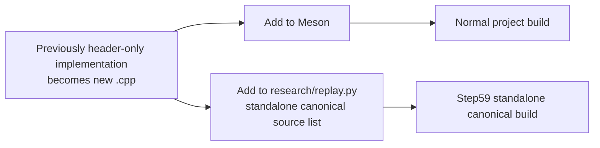

A Meson PASS alone does not prove the standalone Step59 compile source list is complete.

---

# 5. Canonical economic validation

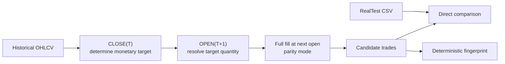

Parity constraints:

```text
slippage = 0
fees = 0
no volume capacity
no synthetic 1e10 / 1e11 liquidity
no hidden exception whitelist
```

---

# 6. Step59 release gate

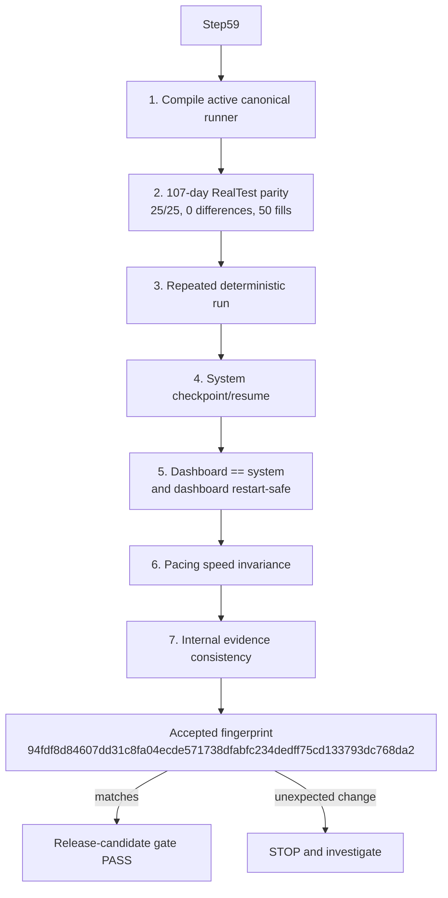

---

# 7. Full-history evidence

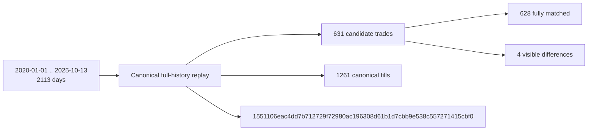

Do not hide the four known differences in implementation.

---

# 8. MOCK exchange overview

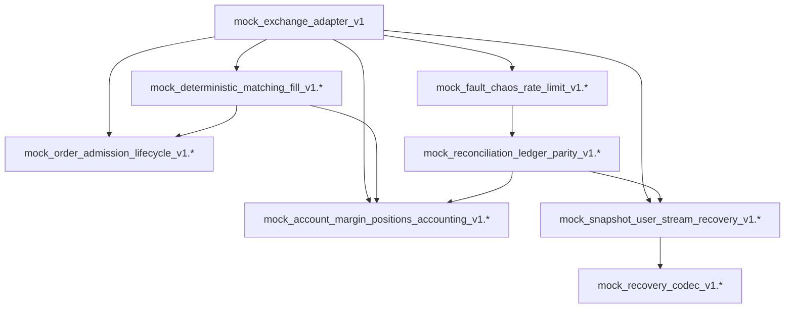

---

# 9. Order lifecycle path

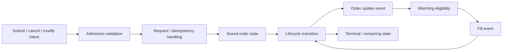

Start here for:
- duplicate orders,
- invalid lifecycle transitions,
- idempotency bugs,
- submit/cancel/modify behavior.

Primary component:

```text
lib/src/exchange/mock_order_admission_lifecycle_v1.*
```

---

# 10. Deterministic matching / fill path

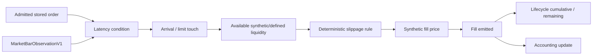

Primary component:

```text
lib/src/exchange/mock_deterministic_matching_fill_v1.*
```

---

# 11. Accounting / position path

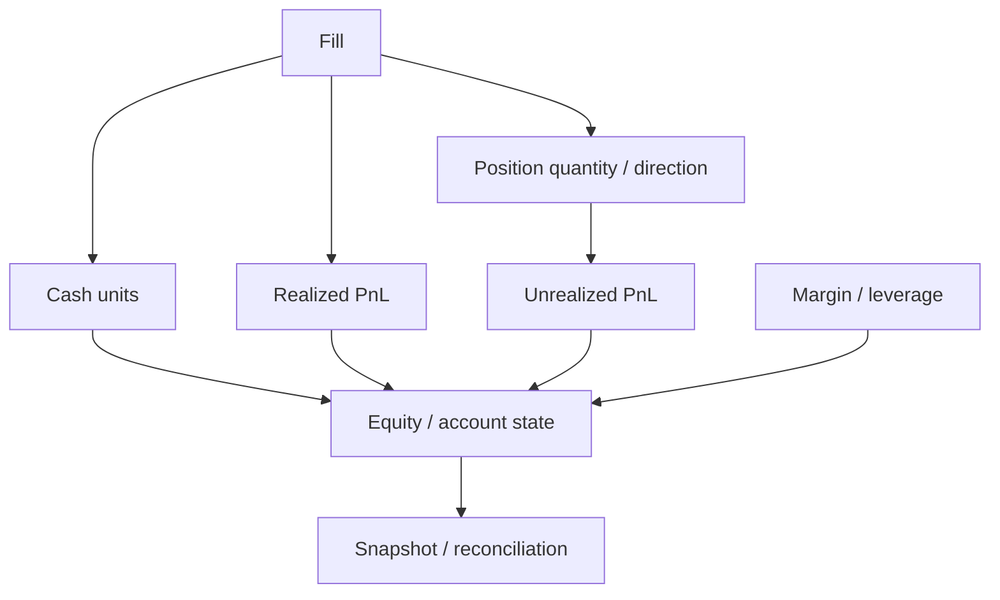

Primary component:

```text
lib/src/exchange/mock_account_margin_positions_accounting_v1.*
```

For PnL bugs verify:
- sign,
- entry basis,
- close/reduction semantics,
- partial fills,
- cash movements,
- realized/unrealized split,
- leverage/margin effects.

---

# 12. Recovery / persistence / reconciliation

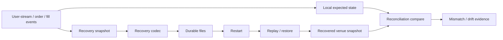

Primary components:

```text
mock_snapshot_user_stream_recovery_v1.*
mock_recovery_codec_v1.*
mock_reconciliation_ledger_parity_v1.*
```

---

# 13. Fault / chaos / rate-limit layer

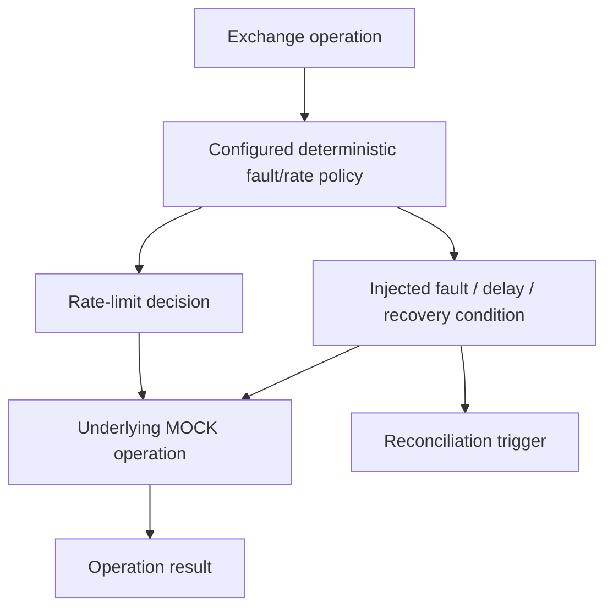

Primary component:

```text
lib/src/exchange/mock_fault_chaos_rate_limit_v1.*
```

---

# 14. Runtime engine relationships

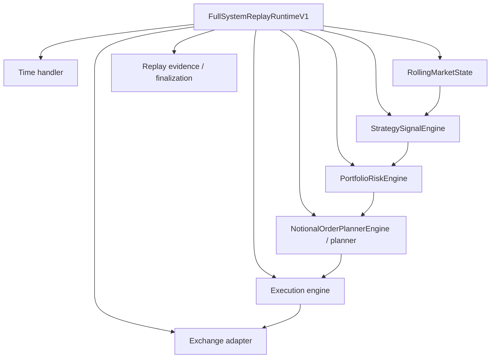

Known runtime files include:

```text
lib/src/runtime/full_system_replay_runtime_v1.*
lib/src/runtime/strategy_signal_engine.*
lib/src/runtime/portfolio_risk_engine.*
lib/src/runtime/notional_order_planner_engine.*
lib/src/runtime/rolling_market_state.*
lib/src/runtime/time_handler.*
lib/src/runtime/trading_engine.*
lib/src/runtime/execution_engine.*
lib/src/runtime/order_planner_engine.*
lib/src/runtime/decision_engine.*
```

Verify exact current names in source before editing.

---

# 15. Strategy-side navigation

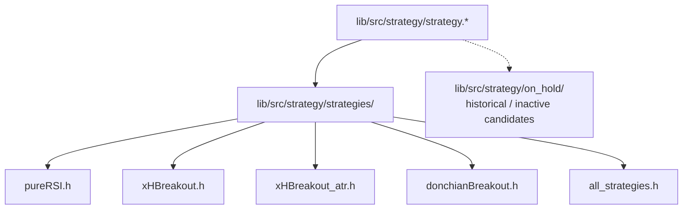

Important:
- `lib/src/strategy/strategies/` was previously ignored by `.gitignore` by mistake.
- Do not re-ignore it.
- Do not blindly modernize `on_hold/` before deciding whether those strategies are still useful.

---

# 16. Live-trading service map

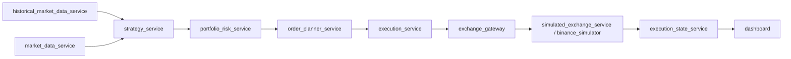

This is a conceptual service flow. Verify transport topics/contracts in source.

The readability rule for these services is:

```text
main() may contain real orchestration.
Do not recreate *_application.* wrappers solely to shorten main().
```

---

# 17. Research — current state

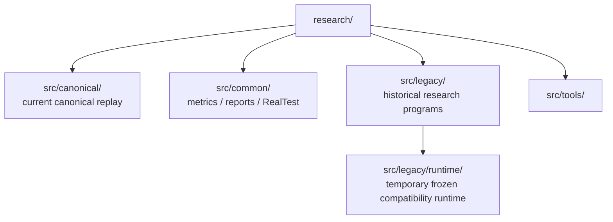

---

# 18. Research — desired migration

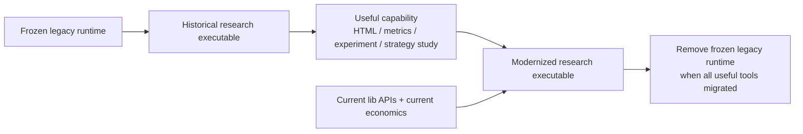

Important distinction:

```text
Research functionality should survive.
Old runtime behavior does not need to survive.
```

The user wants research to reflect the current trading system.

---

# 19. Research migration checklist

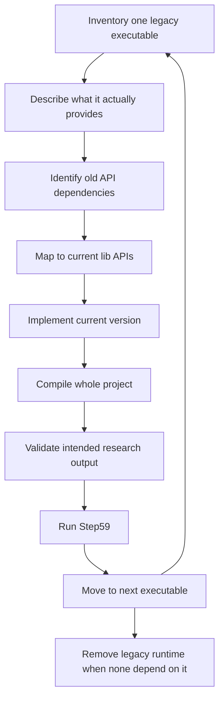

---

# 20. Data / evidence locations

```mermaid
flowchart TB
    STORAGE["storage/"]
    REAL["backtests/final_tests/pureRSI.csv"]
    RUNS["deploy/historical_replay/run/"]
    VALID["validation/"]
    DASHSTATE["dashboard replay state JSON"]
    FP["accepted fingerprints"]

    STORAGE --> REAL
    RUNS --> DASHSTATE
    VALID --> FP
    REAL --> VALID
    DASHSTATE --> VALID
```

Known accepted fingerprints:

```text
Compact 107-day:
94fdf8d84607dd31c8fa04ecde571738dfabfc234dedff75cd133793dc768da2

Full history:
1551106eac4dd7b712729f72980ac196308d61b1d7cbb9e538c557271415cbf0

Later-date pacing proof:
b85026fe0cf5206dc4120af9b3a12cdc6a2a978d08faf69b0dc99b602bbe9024
```

---

# 21. Replay warm-up semantics

```mermaid
flowchart LR
    START["--start"]
    COLD["Simulation starts cold"]
    ROLL["Rolling indicators / universe / rankers"]
    DIFFER["Mid-history results can differ without warm-up"]

    PSTART["--pace-start / --pace-end"]
    WARM["Earlier history still processed"]
    DISPLAY["Only selected period is paced/displayed"]

    START --> COLD --> ROLL --> DIFFER
    PSTART --> WARM --> DISPLAY
```

Use pace controls to visually inspect a later interval without losing warm state.

---

# 22. How to investigate a duplicate order

```mermaid
flowchart TB
    DUP["Duplicate order observed"]
    SIG["Was strategy signal duplicated?"]
    DEC["Was decision emitted twice?"]
    PLAN["Was same target planned twice?"]
    REQ["Same or different request/idempotency key?"]
    LIFE["Admission lifecycle accepted twice?"]
    REC["Recovery replay reapplied command/event?"]
    FILL["Actually duplicate order or duplicate fill/display?"]

    DUP --> SIG --> DEC --> PLAN --> REQ --> LIFE --> REC --> FILL
```

---

# 23. How to investigate a PnL mismatch

```mermaid
flowchart TB
    PNL["PnL mismatch"]
    FILL["Compare fills first"]
    QTY["Check quantity resolution"]
    PX["Check execution price"]
    SIGN["Check side / position sign"]
    PART["Check partial/reduction handling"]
    FEES["Check fee/slippage mode"]
    BASIS["Check cost basis"]
    REAL["Realized PnL"]
    UNREAL["Unrealized mark"]
    EQ["Cash/equity reconciliation"]

    PNL --> FILL
    FILL --> QTY
    FILL --> PX
    QTY --> SIGN
    PX --> PART
    PART --> FEES
    FEES --> BASIS
    BASIS --> REAL
    BASIS --> UNREAL
    REAL --> EQ
    UNREAL --> EQ
```

---

# 24. How to investigate look-ahead / leakage

```mermaid
flowchart LR
    BAR["Bar T"]
    OBS["What data is visible at decision time?"]
    SIGNAL["Signal timestamp"]
    TARGET["Target monetary value"]
    NEXT["Next bar OPEN(T+1)"]
    QTY["Resolve quantity"]
    FILL["Fill"]
    FUTURE["Any CLOSE/HIGH/LOW from future bar used early?"]

    BAR --> OBS --> SIGNAL --> TARGET --> NEXT --> QTY --> FILL
    OBS --> FUTURE
```

For historical parity specifically:

```text
target money at CLOSE(T)
quantity at OPEN(T+1)
fill at next open
```

---

# 25. Documentation hierarchy

```mermaid
flowchart TB
    AGENTS["AGENTS.md<br/>short operating rules"]
    CONTEXT["docs/codex/CONTEXT_FULL.txt<br/>long state/history/constraints"]
    ARCH["docs/codex/ARCHITECTURE_FULL.md<br/>navigation graphs"]
    READMES["lib/README.md + live_trading/README.md + research/REPLAY.md"]
    SOURCE["Actual source code"]
    TEST["Current build/test output"]

    AGENTS --> CONTEXT
    AGENTS --> ARCH
    CONTEXT --> READMES
    ARCH --> READMES
    READMES --> SOURCE
    SOURCE --> TEST
```

Priority when facts disagree:

```text
current source + current test output
> active docs
> full Codex context
> historical notes
```

---

# 26. Current cleanup sequence

```mermaid
flowchart LR
    LIVE["live_trading readability<br/>done"]
    LIB["lib readability / structure<br/>current"]
    RESEARCH["research modernization<br/>next"]
    AI[".ai repository index"]
    DOCS["sync current docs"]
    VPS["VPS equivalence"]
    HL["Hyperliquid current API"]
    TESTNET["TESTNET"]
    SHADOW["Shadow mode"]
    VISUAL["Long visual acceptance"]
    MAIN["MAINNET hardening"]
    LIVEGO["Minimal-capital LIVE"]

    LIVE --> LIB --> RESEARCH --> AI --> DOCS --> VPS --> HL --> TESTNET --> SHADOW --> VISUAL --> MAIN --> LIVEGO
```

---

# 27. Where to start — quick path table

| Goal | Start here |
|---|---|
| Understand repository rules | `AGENTS.md` |
| Understand current project state | `docs/codex/CONTEXT_FULL.txt` |
| Understand overall architecture | `docs/codex/ARCHITECTURE_FULL.md` |
| Understand library domains | `lib/README.md` |
| Understand live services | `live_trading/README.md` |
| Canonical CLI | `research/replay.py` |
| Canonical C++ entrypoint | `research/src/canonical/canonical_replay.cpp` |
| Full replay orchestration | `lib/src/runtime/full_system_replay_runtime_v1.*` |
| Strategy signal runtime | `lib/src/runtime/strategy_signal_engine.*` |
| Risk runtime | `lib/src/runtime/portfolio_risk_engine.*` |
| Planner runtime | `lib/src/runtime/notional_order_planner_engine.*` / related planner code |
| Active strategies | `lib/src/strategy/strategies/` |
| Indicator calculations | `lib/src/indicator/` |
| Universe/ranking | `lib/src/universe/`, `lib/src/ranker/`, `lib/src/filter/` |
| Execution | `lib/src/execution/` |
| MOCK exchange facade | `lib/src/exchange/mock_exchange_adapter_v1.h` |
| Order admission/lifecycle | `lib/src/exchange/mock_order_admission_lifecycle_v1.*` |
| Deterministic matching/fills | `lib/src/exchange/mock_deterministic_matching_fill_v1.*` |
| Positions/margin/accounting | `lib/src/exchange/mock_account_margin_positions_accounting_v1.*` |
| Snapshot/restart | `lib/src/exchange/mock_snapshot_user_stream_recovery_v1.*` |
| Recovery serialization | `lib/src/exchange/mock_recovery_codec_v1.*` |
| Fault/rate-limit behavior | `lib/src/exchange/mock_fault_chaos_rate_limit_v1.*` |
| Reconciliation | `lib/src/exchange/mock_reconciliation_ledger_parity_v1.*` |
| Wire/JSON contracts | `lib/src/contracts/`, `lib/src/transport/` |
| RealTest baseline | `storage/backtests/final_tests/pureRSI.csv` |
| Release validation | `validation/step59_canonical_replay_release_gate.sh` |
| Historical research programs | `research/src/legacy/` |
| Temporary compatibility runtime | `research/src/legacy/runtime/` |

---

# 28. Rules for Codex before changing code

```mermaid
flowchart TB
    TASK["Receive task"]
    READ["Read AGENTS + relevant context"]
    STATUS["git status --short"]
    TRACE["Trace relevant source path"]
    PLAN["Choose smallest coherent change"]
    EDIT["Edit"]
    BUILD["Compile relevant/full target"]
    GATE["Run Step59 if lib/canonical/cross-cutting"]
    DIFF["Review git diff"]
    DONE["Done"]
    INVEST["Investigate unexpected behavior"]

    TASK --> READ --> STATUS --> TRACE --> PLAN --> EDIT --> BUILD --> GATE
    GATE -->|"expected fingerprint"| DIFF --> DONE
    GATE -->|"failure / changed fingerprint"| INVEST --> TRACE
```

---

# 29. What not to do

```mermaid
flowchart TB
    BAD["Avoid"]
    BAD --> W1["Do not make one-line main + pointless application wrapper"]
    BAD --> W2["Do not split coherent code into dozens of tiny files"]
    BAD --> W3["Do not change economic semantics during readability cleanup"]
    BAD --> W4["Do not hide known RealTest differences"]
    BAD --> W5["Do not trust historical runtime as current design"]
    BAD --> W6["Do not accept changed fingerprint without investigation"]
    BAD --> W7["Do not log secrets"]
    BAD --> W8["Do not run long/full-history jobs unnecessarily"]
```

---

# 30. Desired final architecture principle

```mermaid
flowchart TB
    CORE["One current trading core in lib/"]
    LIVE["Live services"]
    REPLAY["Canonical replay"]
    RESEARCH["Research workflows"]
    DASH["Dashboard"]
    ADAPTER["Hyperliquid / exchange adapters"]

    CORE --> LIVE
    CORE --> REPLAY
    CORE --> RESEARCH
    CORE --> DASH
    CORE --> ADAPTER
```

Different workflows may have different orchestration, reporting, adapters, or execution environments, but they should not silently duplicate core economic logic.

