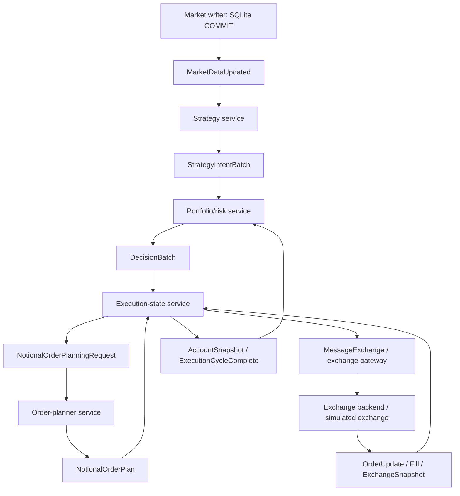

# Current architecture and source navigation

This is the current architecture map, checked against source on 2026-10-07.
[The documentation index](../README.md) lists the maintained guides;
[CURRENT_STATE.md](../../CURRENT_STATE.md) records validation evidence and limitations.
Source and current build/test output take precedence over these descriptions.

## Repository map

| Directory | What belongs here |
| --- | --- |
| `lib/` | Current reusable trading domain and venue simulation. |
| `live_trading/` | Service entrypoints, adapters and service-owned lifecycle. |
| `research/` | Public replay CLI, canonical runner and research executables. |
| `dashboard/` | React UI, Go read-model API, observability stores and deployment. |
| `validation/` | Current release gate, component tests and focused source audits. |
| `deploy/` | LIVE and isolated historical Compose deployments and packaging. |
| `config/` | Runtime configuration, source-symbol maps and venue registries. |
| `docs/` | Documentation index, agent handoff and frozen venue specifications. |
| `storage/` | Historical inputs, reports and accepted run evidence. |
| `tools/` | Analysis utilities and historical diagnostic runners. |

Generated replay state and outputs live under `deploy/historical_replay/run/`.
They are evidence or runtime data, not additional implementation directories.

## Library responsibilities

Start at an orchestration file and follow its collaborators. The detailed file map is
[lib/README.md](../../lib/README.md).

| Directory | Responsibility and useful starting files |
| --- | --- |
| `data_types/`, `market/` | Bars, canonical visible history, price snapshots; `canonical_market_data_reader.*` and `rolling_market_state.*`. |
| `indicator/`, `universe/`, `ranker/`, `filter/` | Features, liquidity selection, ranking and filters. `AlphabeticalRanker` means deterministic ordering without indicator scoring. |
| `strategy/`, `signal/` | Strategy interfaces, instances and signal state; `strategy_signal_engine.*` orchestrates intent generation. |
| `strategy/validated/` | Accepted concrete strategies; currently only `pure_rsi.h`. |
| `risk/`, `sizing/`, `portfolio/`, `rebalance/` | Allocation, constraints, approved targets and rebalance policy; `portfolio_risk_engine.*` and `portfolio_targets.h`. |
| `execution/` | Stateful execution engine, orders, fills and order manager. |
| `execution/planning/` | Monetary/quantity planners, immutable planning state, target resolution and order construction. |
| `exchange/` | Venue interfaces; implementations are grouped below. |
| `exchange/mock/` | Admission, matching, accounting, recovery, reconciliation, fault simulation and catalog/rules. Start at `exchange.h`. |
| `exchange/adapters/` | `MessageExchange`, `BackendGateway` and `SimulatedExchange`. |
| `runtime/` | `decision_engine.*`, `trading_engine.*`, `replay_runtime.*` and `manual_trading.h`: workflows rather than component ownership. |
| `contracts/` | Market/execution messages, decision/account snapshots and canonical venue contracts. Related small messages share headers. |
| `transport/` | `MessageBus`, `JetStreamBus`, `MessageJson` and `MessageSubjects`. Wire subject versions remain part of the protocol. |
| `persistence/`, `recovery/` | SQLite/PostgreSQL state stores, recovery coordination and reconciliation. |
| `account/`, `position/` | Account and current/target/virtual strategy positions. |
| `backtest/`, `analytics/` | Lightweight historical loop and reporting: `backtester.*`, `backtest_results.cpp`, `BacktestAccountSnapshot`. |
| `logging/`, `utils/`, `testing/` | Logging, shared technical helpers, `TimeHandler` and test doubles. |

Small modules stay flat. Planning, venue implementations and validated strategies have
subfolders because they are distinct responsibilities. There are no forwarding headers
for removed names. Ignored `strategy/on_hold/` experiments are outside the supported
build and may still use the old research API.

## Canonical replay

Public entrypoint: [research/replay.py](../../research/replay.py).
The CLI selects a window/profile, builds the runner, invokes it and compares exports
directly with RealTest. Full usage: [research/REPLAY.md](../../research/REPLAY.md).

```mermaid
flowchart LR
    INPUT["Original historical OHLCV"] --> CLOSE["Completed close(T)"]
    CLOSE --> SIGNAL["Strategy intent"]
    SIGNAL --> RISK["Risk / monetary targets"]
    RISK --> PLAN["Notional plan"]
    PLAN --> OPEN["Execution at open(T+1)"]
    OPEN --> VENUE["Canonical MOCK admission / fills"]
    VENUE --> ACCOUNT["Positions / accounting / reconciliation"]
    ACCOUNT --> OUTPUT["Fingerprint / exports / comparison"]
```



- `fast` invokes `research/src/legacy/backtesting_main.cpp`, whose current
  build uses CURRENT `lib/backtest/Backtester`. The directory name does not imply
  that this particular executable uses the frozen runtime.
- `system` invokes `research/src/canonical/canonical_replay.cpp` and
  `lib/src/runtime/replay_runtime.*`: modern strategy, risk, planning and MOCK.
- `dashboard` uses the same system economics and publishes replay state for
  the simulation provider. UI observation and pacing do not change fills.

### Timing and economics

Strategy/risk read completed `close(T)`. In `realtest-parity`, risk fixes
monetary targets at that close and quantity is resolved using `open(T+1)`.
Exits flatten the actual held parity quantity. The exact double-precision economic
mirror preserves research sizing and exports, while the canonical venue still exercises
its rule-conforming lifecycle and reconciliation. It is not a new independent strategy.

Parity has zero fees/slippage, full next-open fills and no historical-volume capacity
limit. Original OHLCV is never rewritten. `mock-default` retains venue grids,
fees, volume participation, slippage and partial fills. Do not carry parity shortcuts
into ordinary venue execution.

`--start` starts cold; `--pace-start`/`--pace-end` observe a later
interval after earlier history has warmed the state. `--days` selects available
historical days, including the cutoff. The comparator treats campaigns still open at
that cutoff separately from closed trades; no mismatch identity is whitelisted.

### Restart/resume

System/dashboard checkpoints are safe only after a completed close. The MOCK durable
checkpoint and replay boundary agree. Resume removes journal entries after that boundary,
recovers venue state and deterministically rebuilds strategy/risk/planner state through
the same close before continuing. The CLI requires the same label/window.
The release gate compares resumed, uninterrupted, dashboard and paced fingerprints.

## Service trading

The service responsibilities and intended execution chain are documented in [live_trading/README.md](../../live_trading/README.md).



`execution_service` is a separate direct execution-engine service path.
The default `deploy/live` deployment stops at `NotionalOrderPlan`;
execution-state does not submit exchange orders there. The diagram includes the full
execution/backend chain supported by other runtime components, not a claim that LIVE
private routing is connected. Gateway is an optional transport-only profile.
`binance_simulator` serves Binance-compatible HTTP; it does not own canonical
market-data SQLite. The historical feeder shares `market_store.*` with the live
writer and gates historical visibility before committing each day.

### Durability

- Market-data SQLite commits before the update notification is published.
- Strategy/risk/planner publish deterministic output before marking their input
  checkpoint handled. Redelivery can reproduce output; deterministic identities and
  downstream deduplication prevent economic duplication.
- Execution persists owned state/outbox before dispatch and applies fills once by ID.
- Plans represent intent, not fills. Account state changes from actual execution events.
- `Ack` means handled durably; `Retry` requests redelivery; `Terminate`
  rejects an invalid input permanently for that consumer.

Follow the actual handler/store ordering when changing a service. Do not assume every
service has the same commit/publish sequence.

### Business versus technical time

`lib/src/utils/time_handler.*` controls economically visible time.
`time_handler_factory.*` parses environment settings. Daily scheduling and candle
visibility use business time. Polling, backoff and shutdown responsiveness use real
technical time and must not accelerate with replay.

There is no shared logical-clock service, replay controller, ClockState control plane
or `deploy/distributed_replay/`. The isolated historical Compose workflow creates
one `time.env` per run and shares its immutable reference settings among services.
It is a separate integration workflow, not the canonical RealTest release entrypoint.

## Research migration

Six executables still use `research/src/legacy/runtime/`:
HTML metrics/reports, BTC moving-average experiments, initial parameter studies,
multi-strategy experiments, statistical studies and XH-breakout testing.
Their exact entrypoint names are listed in the handoff and legacy runtime README. Their frozen engine is temporary
compatibility support, not the intended architecture.

The next task is to map those consumers to current APIs, beginning with the HTML report
tool: preserve its reports/data contracts, build it against CURRENT `lib/`, and
compare a bounded study before migrating the remaining tools. Delete the frozen runtime
only after useful consumers have migrated. Exact source paths and the research backlog
are in [CONTEXT_FULL.txt](CONTEXT_FULL.txt).

## Dashboard boundary

React talks to the Go API over authenticated HTTP and SSE. Browsers do not connect to
PostgreSQL, SQLite, NATS or an exchange. The API's `mock`, `real` and
`simulation` providers are different read-model sources.

Real reads use bounded PostgreSQL queries, canonical SQLite and retained NATS snapshots.
SSE asks the browser to refresh resources; it does not expose raw trading messages.
Watchdog alerts, notification receipts, manual-intent audits and acknowledgements have
their own stores; they are not canonical fills or PnL.

Manual preview/route enforce operator authentication and CSRF. Route evaluates admission
and durably audits an intent with `submitted=false`; no private exchange order is
sent. Public venue metadata/symbol/rule checks do not establish private execution readiness.
Fill-derived ledger projections are not durable cost-basis/PnL accounting.

See [dashboard/README.md](../../dashboard/README.md) and its five detailed guides in
`dashboard/docs/`. Dashboard loss must not stop trading.

## Validation and retained history

The default WSL gate is `bash validation/step59_canonical_replay_release_gate.sh`.
Its compact expected fingerprint is:

```text
94fdf8d84607dd31c8fa04ecde571738dfabfc234dedff75cd133793dc768da2
```

[validation/README.md](../../validation/README.md) maps component tests, current service
audits and optional runtime checks. Frozen `docs/venue/step*/` specifications and
checksum manifests remain at their original paths because gates consume them. Some
historical source paths/checksums predate renames; they are not current navigation.
Do not regenerate them to hide drift.

The compact gate does not replace a full-history manual comparison, a paced browser
campaign, broker/container recovery tests or private TESTNET/shadow readiness work.
